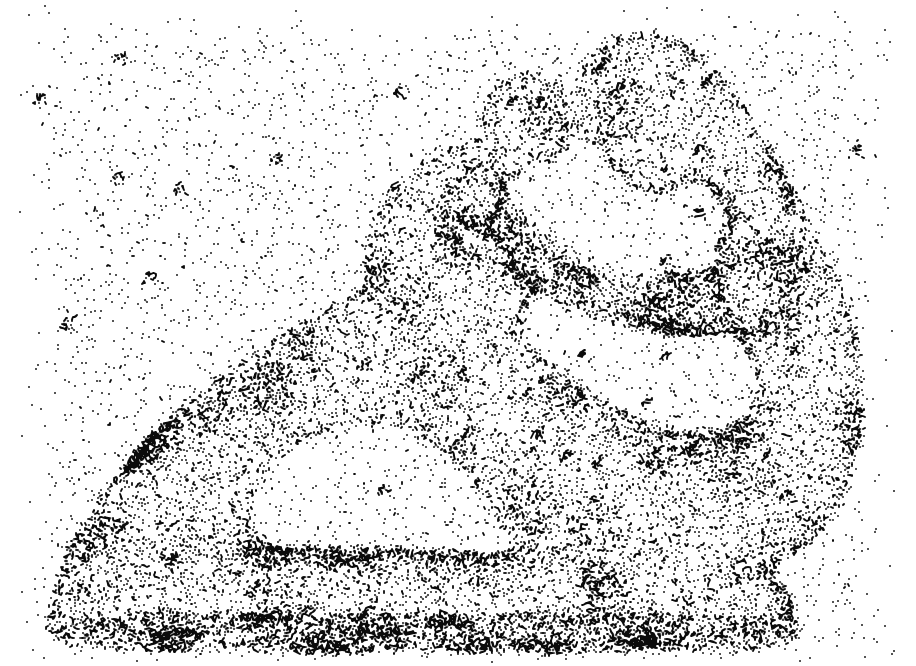
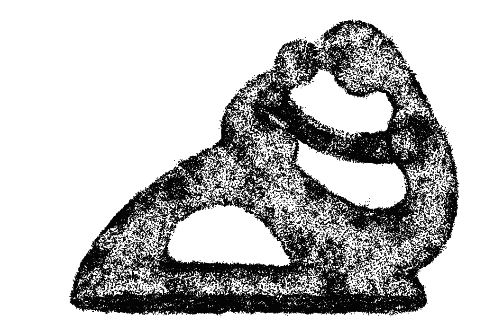
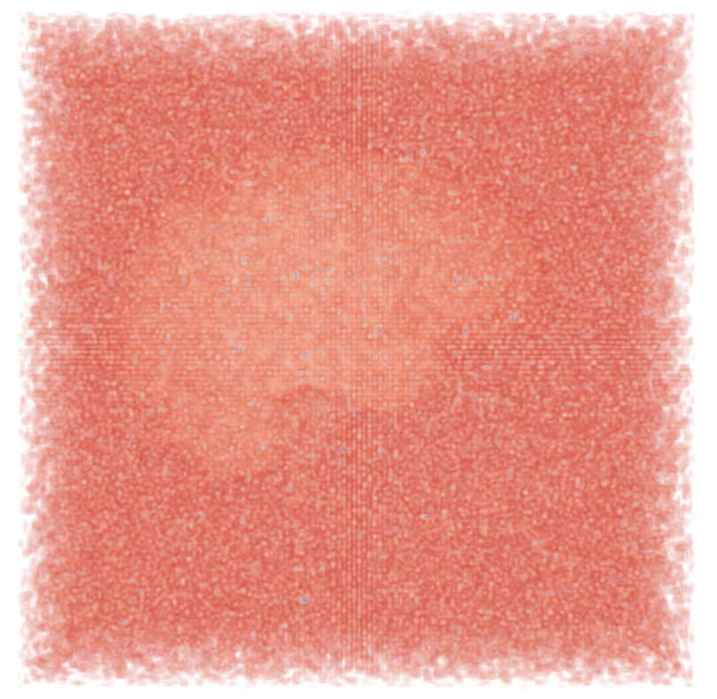
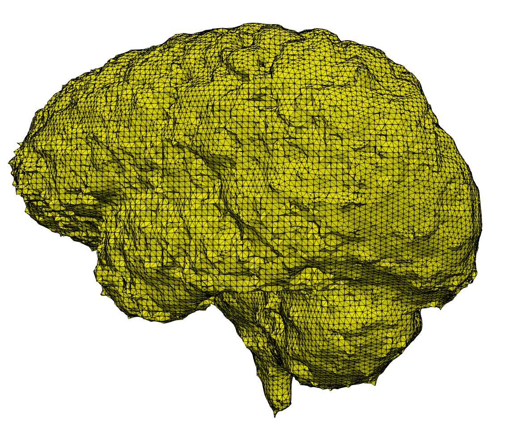

# MorseRecon
### Dependencies
1. Install CGAL [Version 4.14]
2. Install Boost [Version 1.66.0]

### Compile Region3D and Refine
mkdir build

cd build

cmake ..

make


### Refinement
./Refine \<dataset_name\>
### Gaussian Field
python3 data_generator.py \<dataset_name\> \<std_dev\>

### Denoise
./Region3D dataset_name threshold

### Extract
python3 extract_vertices.py \<dataset_name\> delta_for_recon

This will create a .txt file inside dataset_name directory.

### Dataset file format
1. Create a dir <dataset_name>
2. Put the point cloud file named dataset_name_vert_Q.txt in the following format:

x_0 y_0 z_0

x_1 y_1 z_1

...

3. ./Refine \<dataset_name\>: It will create a dir\_name\_vert\_refined.txt in the dir.

4. For denoising data_generator.py will create a .txt file in the Perseus file format. First line is 3, next line is the number of points. And to be consistent with Perseus format, please put 1 and 1 in the next two lines.

3

Number of points

1

1 

val_0

val_1

...

val_(n-1)


4. For Noisy 3D image create a .txt file named dataset_name.txt inside dataset\_name dir.
5. Put the intensity values in the above file format.
6. The Perseus file format can be found [here](http://people.maths.ox.ac.uk/nanda/perseus/). Please look at the **Cubical Toplexes** section.

### Datasets
Please keep the folder structure intact. Note that for 3D Grayscale image data (Noisy_brain and Noisy_liver) You do not need to refine. For the points ( MotherChild ) you need to refine and then compute the Gaussian Field. For the images the gradient is already computed and saved as Perseus file format. The reconstructed faces for the images are at \<dir_name\> \ regions \

Output format:

v_ind_1 v_ind_2 v_ind_3 -> This is for face_0

v_ind_1 v_ind_2 v_ind_3 -> This is for face_1

These v_ind corresponds to vertices of "\<dir_name\>\_vert.txt"


### Example
#### Denoising

./Refine MotherChild

python3 data_generator.py MotherChild 24.48

./Region3D MotherChild 0.0005

python3 extract_vertices.py MotherChild 0.0005


#### Noisy 3D Image

./Region3D Noisy_brain 20


#### Denoising results
Noisy Dataset           |  Denoised and post-processed
:-------------------------:|:-------------------------:
  |  
  |  
 
### Paper
The paper is accepted in CGI 2021. Link [https://link.springer.com/article/10.1007/s00371-021-02255-7](https://link.springer.com/article/10.1007/s00371-021-02255-7)

If you are benefitted from the code, please cite the paper as:
```
@article{mukherjee2021denoising,
  title={Denoising with discrete Morse theory},
  author={Mukherjee, Soham},
  journal={The Visual Computer},
  volume={37},
  number={9},
  pages={2883--2894},
  year={2021},
  publisher={Springer}
}
```

